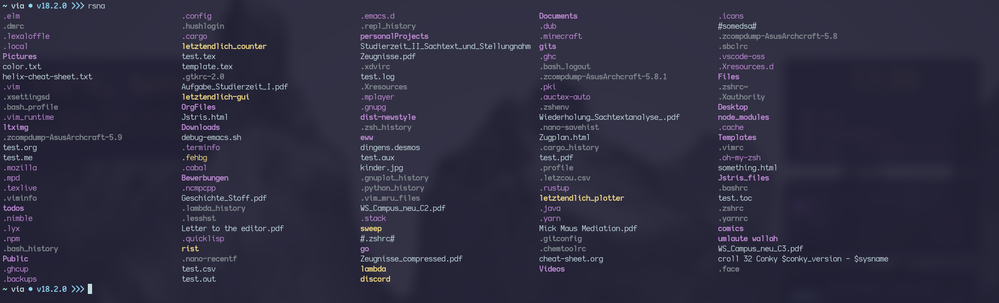

# rist
A list files utility written in rust.
It's not the best out there in any way, I myself don't know much about coding and interfacing with the filesystem.
## Install
To install simply clone this repo and compile using a nightly build of rustc.
This is because the fetching of the terminal width -used to determine the amount of items to fit on one line, given it's not configured in the config- relies on unstable interfacing with C.
I could have simply used a crate to have said functionality, however I didn't want to rely on 3rd party packages.
### Terminal Width Fetching; NOTE
Theres a constant named "TIOCGWINSZ", which holds the value, which the little piece of C code "helper.c" outputs. I do not know what the value relies on, as I simply copied the code off of the internet, and as such you might need to change it, I myself used alacritty and Arch linux, either of which I imagine could have an impact.
## Flags
There are few flags available as of now:
- `-a `> display hidden files
- `-nc`> use defaults and extrapolate items per line, instead of config
- `-t `> print the time it took to execute
## Screenshot
Note: rsna is an alias I have configured in my .zshrc, the actual command would be ./main -a -nc

